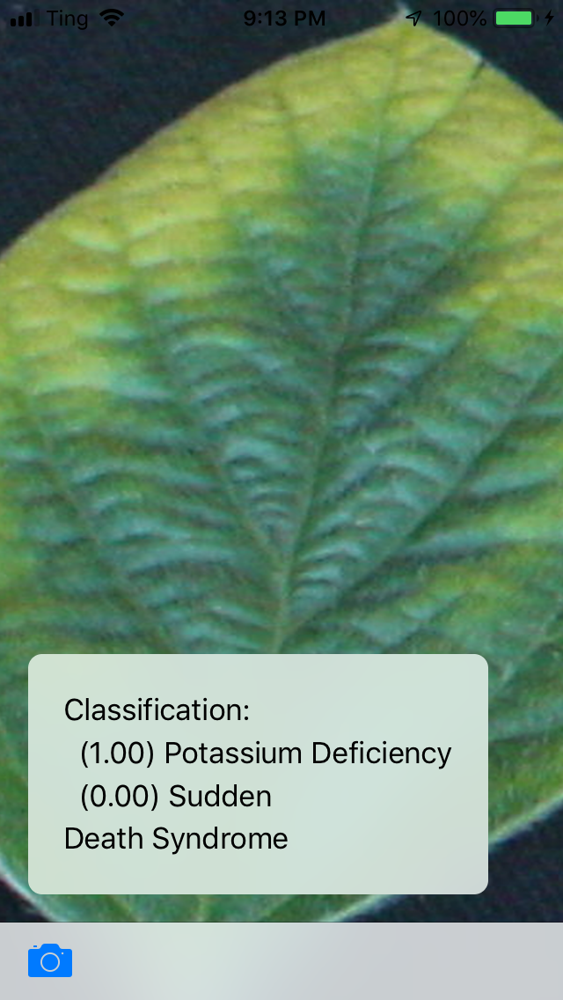
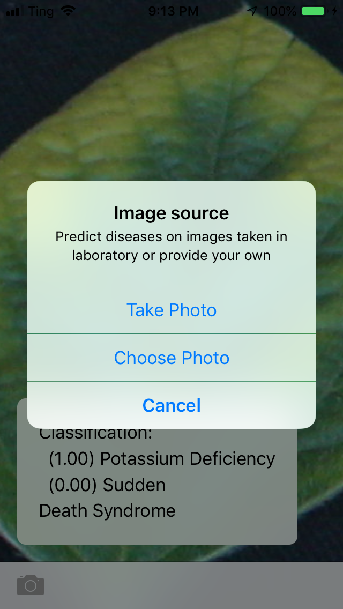

# SoybeanDiseasePredictor

 SoybeanDiseasePredictor is a mobile application which can detect 10 classes of soybean diseases. It run on Iphone and Ipad on iOS 11 or above.

## Getting Started

<p align="middle">
  
   
</p>

WebAnnotation consit of a Webapp, a server and a database so it will take a bit of time to install. We recommend installing on an Unix OS (Preferbly Ubuntu LTS version). For other OSs, please follow platform specific steps to install the required softwares.

### Prerequisites

Install [LAMP stack](https://www.linode.com/docs/web-servers/lamp/install-lamp-stack-on-ubuntu-18-04/)

Appache Server for serving the app though http

```
sudo apt install apache2
```
MySQL server for storing annotation

```
sudo apt install mysql-server
```

PHP for server side scripting

```
sudo apt install php7.2 libapache2-mod-php7.2 php-mysql
```

Install Node.js v8.x for writing web app

```
curl -sL https://deb.nodesource.com/setup_10.x | sudo -E bash -
sudo apt-get install -y nodejs

```

### Installing


Change the directory to root project folder

```
cd /WebAnnotation/www/html/sds_tagger
```

Install project dependencies

```
npm install
```

Compile the source code

```
npx webpack
```

Create a MySQL database according to specs (please consult an expert on this task)

```
/WebApp/www/html/sds_tagger/api/sql/create_tables.sql
```

Create a symbolic link to http server root folder (the trailing dot is intened)

```
cd /var/www/
ln -s link/to/WebApp/www .

```

End with an example of getting some data out of the system or using it for a little demo

## Deployment

From the machine installed this software, point the web browser at

```
http://localhost:8080
```

Depending on how you setup the http server, the postfix port could be different than 8080 and to access the app outside of the lab you need the IP address of this particular computer. Once openned, the app cycles through a directory of images, allowing users to mark on them where they believe certain infected areas are.

### General Instructions

* Drag the DS score into the 'DS score' list. The currently selected DS score has a red border around it.
* Click and drag on the image where you believe the selected disease is located. Upon releasing the mouse, the path will form a rectangle.
* Add more DS scores if desired by dragging another option onto the DS score list. Continue marking diseases you believe are in the image.
* Once you are done marking an image, click 'Save/Next Image'. The marked image will be replaced with the next one, and all data is reset. Continue this procedure to keep marking images, your progress is shown in the upper right corner. 
* A message will be shown when you have marked all images.

### Options and Controls
* 'Show Selected Disease Only' - If checked, will only show markings on the image for the currently selected disease (all markings will still be drawn on the output image. If you'd like an image for each disease, send me an email to the above address and I could add that feature). Otherwise all markings are shown.
* 'Fill selection' - If checked, marked paths are filled in.
* 'Clear' - resets all markings and data for the current image
* 'Clear Selection' - resets only the markings and data for the currently selected disease (useful if you've already made several marks, but made one mistake).
* 'Undo' - removes the last drawn marking, and data associated with it

## Built With

* [Typescript](https://www.typescriptlang.org/) - A superset of Javascript, used for the app logic
* [Webpack](https://webpack.js.org/) - Javascript transpiler
* [Node.js](https://nodejs.org/en/) - Provide framework for working with web related technology
* [PHP](http://www.php.net/) - Server side app 
* [Apache Server](https://httpd.apache.org/) - http server
* [MySql](https://www.mysql.com/) - database

## Contributing

We follow Iowa State University [authorship policy](https://www.policy.iastate.edu/authorship), please send requests to us at the address: baskarg@iastate.edu

## Versioning

We use [git](https://git-scm.com/) for versioning. For the versions available, use the [git tagging](https://git-scm.com/book/en/v2/Git-Basics-Tagging). 

## Authors
* **Truong Tran** - *App-Server communication, Interface, Touch support* - [LinkedIn](https://vn.linkedin.com/in/truong-tran-62643194)
* **Alect lofquist** - *SQL database*
* **Jacob Stimes** - *initial interface*

See also the research project info at [lab website](https://baskar-group.me.iastate.edu/) for detail information.

## License

Copyright 2018 Baskar Ganapathysubramanian, all rights reserved

## Acknowledgments

We gratefully acknowledge support from Plant Science Institute at Iowa State University.
